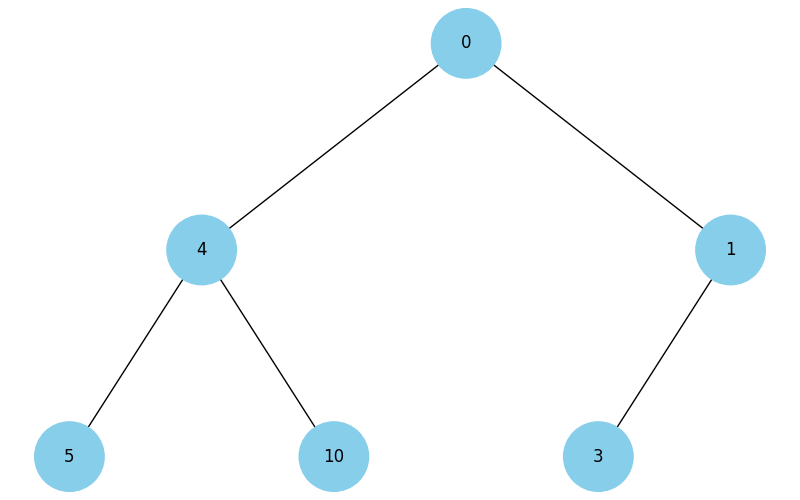

# Final project of the course "Basic Algorithms and Data Structures"

### Task 1. Data Structures. Sorting. Working with a Singly Linked List

To implement a singly linked list (an example implementation can be taken from the notes), you need to:

- Write a function that reverses a singly linked list by changing the references between the nodes.
- Develop a sorting algorithm for the singly linked list, for example, insertion sort or merge sort.
- Write a function that merges two sorted singly linked lists into one sorted list.

### Task 2. Recursion. Creating a Pythagoras Tree Fractal Using Recursion

Write a Python program that uses recursion to create a Pythagoras Tree fractal. The program should visualize the Pythagoras Tree fractal, and the user should be able to specify the recursion depth.


### Task 3. Trees, Dijkstra's Algorithm

Develop Dijkstra's algorithm for finding the shortest paths in a weighted graph using a binary heap. The task includes creating the graph, using the heap to optimize vertex selection, and computing the shortest paths from the starting vertex to all other vertices.

### Task 4. Visualizing a Heap

The following code constructs binary trees. Analyze the code to understand how it works.

```python
import uuid
import networkx as nx
import matplotlib.pyplot as plt

class Node:
  def __init__(self, key, color="skyblue"):
    self.left = None
    self.right = None
    self.val = key
    self.color = color  # Additional argument to store the node color
    self.id = str(uuid.uuid4())  # Unique identifier for each node

def add_edges(graph, node, pos, x=0, y=0, layer=1):
  if node is not None:
    graph.add_node(node.id, color=node.color, label=node.val)  # Use id and store node value
    if node.left:
      graph.add_edge(node.id, node.left.id)
      l = x - 1 / 2 ** layer
      pos[node.left.id] = (l, y - 1)
      l = add_edges(graph, node.left, pos, x=l, y=y - 1, layer=layer + 1)
    if node.right:
      graph.add_edge(node.id, node.right.id)
      r = x + 1 / 2 ** layer
      pos[node.right.id] = (r, y - 1)
      r = add_edges(graph, node.right, pos, x=r, y=y - 1, layer=layer + 1)
  return graph

def draw_tree(tree_root):
  tree = nx.DiGraph()
  pos = {tree_root.id: (0, 0)}
  tree = add_edges(tree, tree_root, pos)

  colors = [node[1]['color'] for node in tree.nodes(data=True)]
  labels = {node[0]: node[1]['label'] for node in tree.nodes(data=True)}  # Use node value for labels

  plt.figure(figsize=(8, 5))
  nx.draw(tree, pos=pos, labels=labels, arrows=False, node_size=2500, node_color=colors)
  plt.show()

# Creating the tree
root = Node(0)
root.left = Node(4)
root.left.left = Node(5)
root.left.right = Node(10)
root.right = Node(1)
root.right.left = Node(3)

# Displaying the tree
draw_tree(root)
```



Using this code as a base, build a function that will visualize a binary heap.

> 👉🏻 Note: The essence of the task is to create a tree from the heap.

### Task 5. Visualization of Binary Tree Traversal

Using the code from Task 4 to construct a binary tree, you need to create a Python program that visualizes tree traversals: depth-first and breadth-first.

The program should display each step in the nodes with different colors using the RGB hex system (e.g., `#1296F0`). The colors of the nodes should transition from dark to light shades, depending on the traversal sequence. Each node should be assigned a unique color upon visiting, visually reflecting the traversal order.

> 👉🏻 Note: Use a stack and a queue, NOT recursion.

### Task 6. Greedy Algorithms and Dynamic Programming

You need to write a Python program that uses two approaches — a greedy algorithm and a dynamic programming algorithm — to solve the problem of selecting food with the highest total caloric content within a limited budget.

Each type of food has a specified cost and caloric content. The food data is presented as a dictionary, where the key is the name of the dish, and the value is a dictionary with the cost and caloric content.

```python
items = {
    "pizza": {"cost": 50, "calories": 300},
    "hamburger": {"cost": 40, "calories": 250},
    "hot-dog": {"cost": 30, "calories": 200},
    "pepsi": {"cost": 10, "calories": 100},
    "cola": {"cost": 15, "calories": 220},
    "potato": {"cost": 25, "calories": 350}
}
```

Develop a `greedy_algorithm` function that selects dishes to maximize the calorie-to-cost ratio without exceeding the given budget.

For the `dynamic programming` algorithm, create a dynamic_programming function that computes the optimal set of dishes to maximize caloric content within the given budget.

### Task 7. Using the Monte Carlo Method

You need to write a Python program that simulates a large number of dice rolls, calculates the sums of the numbers rolled, and determines the probability of each possible sum.

Create a simulation where two dice are rolled a large number of times. For each roll, determine the sum of the numbers that appear on both dice. Count how many times each possible sum (from 2 to 12) appears during the simulation. Using this data, calculate the probability of each sum.

Based on the simulations, create a table or a graph that displays the probabilities of each sum as determined by the Monte Carlo method.

The probability table for sums when rolling two dice looks like this.


Compare the results obtained using the Monte Carlo method with the analytical calculations provided in the table above.